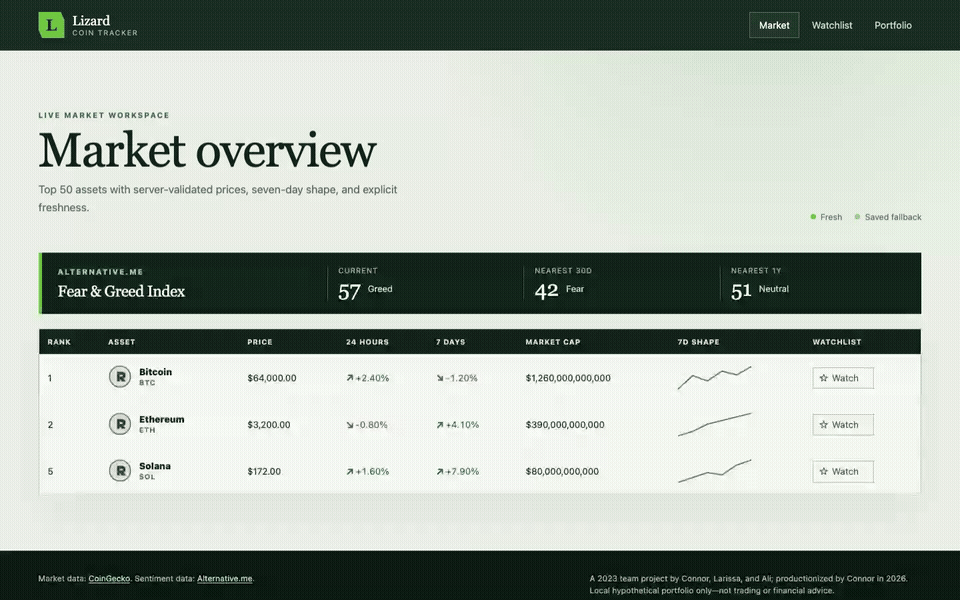
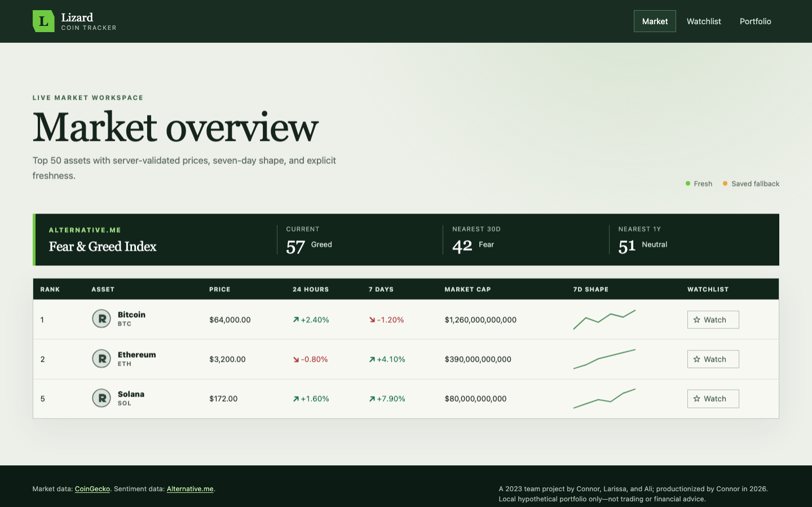
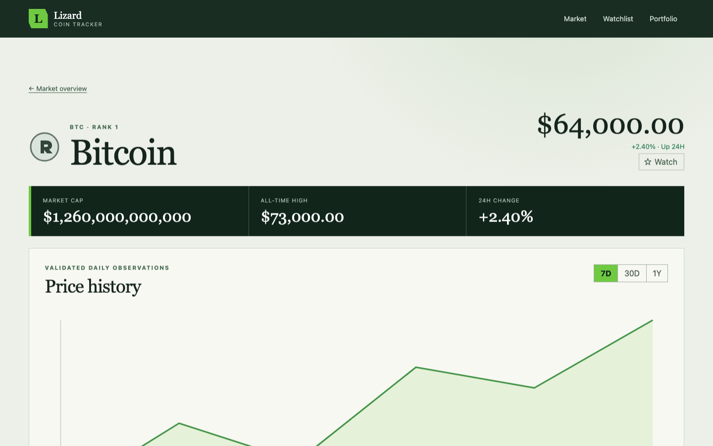
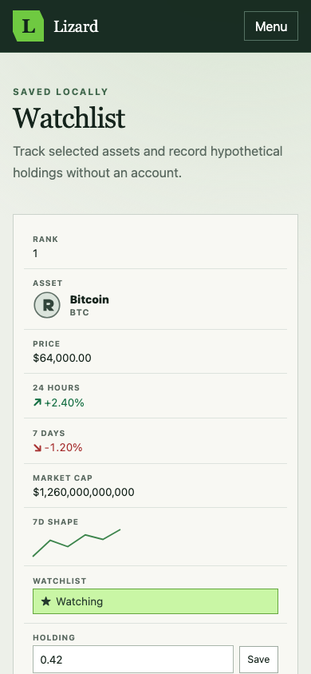
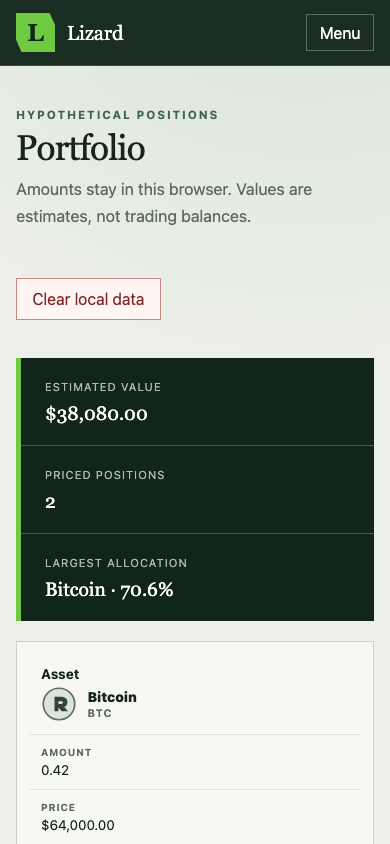
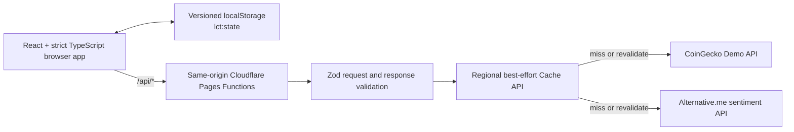

# Lizard Coin Tracker

Lizard Coin Tracker began as a three-person bootcamp project in 2023 and was later maintained and productionized by Connor Grogan in 2026.

> **Deployment status:** the production code and deployment automation are ready, but the canonical Cloudflare URL is not being presented as live until Connor completes the one-time Cloudflare account authorization, secret setup, and production verification in [the deployment runbook](docs/deployment/README.md). The project remains an unpinned secondary team project until that gate and the production measurements pass.

This application tracks the top 50 crypto assets, opens validated detail and chart views, and supports a local watchlist and hypothetical portfolio. It does not trade, connect to a wallet, or provide financial advice.



| Desktop market                                                                                                        | Desktop detail                                                                                          |
| --------------------------------------------------------------------------------------------------------------------- | ------------------------------------------------------------------------------------------------------- |
|  |  |

| Mobile watchlist                                                                      | Mobile portfolio                                                                            |
| ------------------------------------------------------------------------------------- | ------------------------------------------------------------------------------------------- |
|  |  |

The screenshots and GIF use deterministic local API fixtures from the production candidate. They are reproducible product media, not market-performance evidence. The simulated stale state is [documented separately](docs/media/stale-state-desktop.png).

## Ownership and history

The full group history, original license, and attribution are preserved.

| Period                      | Ownership and work                                                                                                                                                                                                                                                                                                                                                                                                                                                   |
| --------------------------- | -------------------------------------------------------------------------------------------------------------------------------------------------------------------------------------------------------------------------------------------------------------------------------------------------------------------------------------------------------------------------------------------------------------------------------------------------------------------- |
| 2023 team project           | [Connor Grogan](https://github.com/connorg45), [Larissa](https://github.com/RissaStack), and [Ali](https://github.com/alihumzahbeig) built the original bootcamp project in [RissaStack/Lizard-Coin-Tracker](https://github.com/RissaStack/Lizard-Coin-Tracker). The latest team revision is [`70630b4`](https://github.com/RissaStack/Lizard-Coin-Tracker/commit/70630b4d7aabb307b37869ce4099e4d9d99a6739).                                                         |
| March 2026 continuation     | Connor's [`238e6e3`](https://github.com/connorg45/crypto-coin-tracker/commit/238e6e32adf07cf1515fbdd6d351f58f08ee0b94) changed the watchlist to stable coin IDs and hardened storage loading. [`96466f3`](https://github.com/connorg45/crypto-coin-tracker/commit/96466f32612274994cdd1e3b9a89ec571b798f40) added coin detail pages, 7D/30D/1Y charts, portfolio holdings and calculations, client-side CoinGecko caching, stale fallback, and visible error states. |
| July 2026 productionization | Connor's signed [`b5c9a08`](https://github.com/connorg45/crypto-coin-tracker/commit/b5c9a08421f17cb2104a678d95a2007a23e092cc) replaces the duplicated static frontend with the typed, tested, accessible architecture described below. The link will resolve after this branch is published.                                                                                                                                                                         |

The original March commits remain unchanged even though their local email is not linked and they are unsigned. Their linked diffs are the evidence for that work. The signed `legacy-baseline-2026-03-26` tag points to `96466f3` without rewriting history. See [the ownership notes](docs/ownership.md).

## Architecture



- React Router owns `/`, `/coin/:id`, `/watchlist`, and `/portfolio`; the root is the actual market dashboard.
- TanStack Query deduplicates browser requests and models loading, fresh, stale, partial-error, and total-error states.
- Shared Zod schemas define both upstream normalization and browser-facing API envelopes.
- Pages Functions keep `COINGECKO_DEMO_API_KEY` off the client and constrain IDs, ranges, upstream URLs, image hosts, and response shapes.
- Plain bundled CSS, local SVGs, and a custom accessible SVG chart replace jQuery, Bootstrap, Font Awesome, Google Fonts, and remote scripts.
- `AppStateV2` keeps the watchlist and hypothetical holdings local. There is deliberately no authentication, database, wallet, or cross-device sync.

Detailed contracts and tradeoffs are in [architecture.md](docs/architecture.md).

## Reliability policy

| Data        |  Fresh TTL | Maximum stale fallback |
| ----------- | ---------: | ---------------------: |
| Markets     | 60 seconds |               24 hours |
| Coin detail | 10 minutes |               24 hours |
| Chart       | 15 minutes |               24 hours |
| Sentiment   | 60 minutes |               72 hours |

A fresh cache hit returns immediately with `X-LCT-Cache: HIT`. A usable stale record returns with `X-LCT-Cache: STALE`, a timestamped UI warning, and background revalidation. A miss gets at most three upstream attempts inside an eight-second deadline. Only network failures and `408`, `425`, `429`, `500`, `502`, `503`, and `504` are retried, using full-jitter delays around 250ms and 750ms. `Retry-After` is honored only up to two seconds. Invalid schemas and other `4xx` responses are not retried.

The Cloudflare Cache API is regional, best-effort, and evictable. Stale availability is conditional evidence, not an SLA. See [reliability.md](docs/reliability.md).

## Local setup

Requirements: Node 24 and npm.

```bash
npm ci
cp .dev.vars.example .dev.vars
npm run dev
```

Add a CoinGecko Demo key to `.dev.vars`:

```text
COINGECKO_DEMO_API_KEY=replace-with-a-demo-key
```

`.dev.vars` is ignored. Never use a `VITE_*` variable for this secret. `npm run dev:ui` starts only the browser app and is useful with mocked APIs; `npm run dev` builds and runs the complete Pages application locally.

## Tests and delivery gates

| Layer               | Coverage                                                                                                               | Gate                                    |
| ------------------- | ---------------------------------------------------------------------------------------------------------------------- | --------------------------------------- |
| Unit/domain         | Portfolio totals, allocations, formatting, invalid and overflow inputs                                                 | Every PR                                |
| Storage             | Malformed JSON, invalid IDs/amounts, dedupe, V1→V2 migration, numeric-rank discard, idempotency                        | Every PR                                |
| Contracts/functions | Provider schemas, cache hit/miss/stale/expiry, concurrent refresh, timeout, `429`, `5xx`, invalid schema, cold failure | Every PR                                |
| Components          | Loading, empty, error, stale, retry, watchlist, holding retention, accessible names                                    | Every PR                                |
| Browser E2E         | Market → detail → range → watchlist → holding → portfolio, reload persistence, partial/total failure                   | Chromium desktop and mobile on every PR |
| Accessibility       | Keyboard path, skip link, focus visibility, `aria-pressed`, live regions, zero serious/critical axe findings           | Every PR                                |
| Cross-browser       | Full flow on Firefox and WebKit                                                                                        | `develop` and nightly                   |
| Delivery            | Format, lint, strict typecheck, coverage, audit, build, bundle budgets, Lighthouse, CodeQL                             | Before production deploy                |

Current local result: 56 unit/component/function tests pass with 95.41% statements, 85.55% branches, 92.25% functions, and 96.25% lines. The full Chromium, mobile Chromium, Firefox, and WebKit matrix passes 41 scenarios with three expected desktop-project skips for the mobile-only check. The dependency audit reports zero known vulnerabilities. CI actions are pinned to immutable commit SHAs.

The complete scenario-to-cadence mapping is in [test-matrix.md](docs/test-matrix.md).

Useful commands:

```bash
npm run format:check
npm run lint
npm run typecheck
npm test
npm run test:e2e
npm run test:e2e:all
npm run lighthouse
npm run audit
npm run build
```

## Measured outcomes

These are controlled local lab results tied to raw files and exact revisions. Both market pages render a fixed 50-asset workload; the legacy copy changes only its provider URL to reach that deterministic fixture. These are not real-user monitoring or production traffic.

| Median metric                    | Baseline `96466f3` | Candidate `b5c9a08` |   Change |
| -------------------------------- | -----------------: | ------------------: | -------: |
| Mobile Lighthouse performance    |                 74 |                  99 |      +25 |
| Mobile Lighthouse accessibility  |                 91 |                 100 |       +9 |
| Mobile LCP                       |            4,780ms |             2,108ms | −2,672ms |
| Mobile CLS                       |              0.024 |               0.012 |   −0.013 |
| Desktop Lighthouse performance   |                 96 |                 100 |       +4 |
| Desktop Lighthouse accessibility |                 91 |                 100 |       +9 |

The candidate also recorded p75 LCP 968ms, p75 INP 16ms, and p75 CLS 0.051 across 20 scripted mobile interactions with fixed throttling and deterministic API fixtures. The Lighthouse and interaction harnesses answer different questions, so their LCP values are not merged.

The generated comparison is [summary.json](docs/metrics/summary.json); methodology and all raw reports are under [docs/metrics](docs/metrics/). Production cache-hit rate, third-party requests avoided, edge p50/p95, stale-data availability, and error rate remain deliberately unclaimed until the canonical deployment exists. Prices, coin counts, clones, visitors, and inferred users are excluded.

## Deployment and go/no-go status

The code, exact-baseline archive generator, hash verifier, Pages configuration, secret boundary, and gated deployment workflow are complete. Account-level Cloudflare authorization is the remaining P0 blocker in this environment. Follow [the deployment runbook](docs/deployment/README.md), then record production evidence before changing the status or pinning the project.

The formal [go/no-go checkpoint](docs/go-no-go.md) is currently **no-go for a pinned or “elite” claim** because the stable production URL and production measurements are not verified. Local engineering gates pass, so the recommendation is to complete the account handoff rather than retire immediately. If that cannot be completed in one focused session, keep this as an unpinned secondary team project.

## Security, attribution, and limitations

- The strict CSP and supporting headers are applied to static and function responses.
- Provider HTML is normalized to text, API data is schema-validated, coin image hosts are allowlisted, and external links isolate their opener.
- Structured logs contain request outcome, cache status, data age, duration, and attempt count—not keys, headers, bodies, holdings, or browser storage.
- CoinGecko provides market data; Alternative.me provides the Fear & Greed Index and is visibly credited next to the data.
- The portfolio is a browser-local hypothetical estimate using top-50 market data. It is not a balance, transaction record, or investment recommendation.

See the [security review](security_best_practices_report.md) for resolved findings and residual operational risks.

## License and acknowledgements

The original MIT license and Larissa's original copyright notice remain in [LICENSE](LICENSE). Thanks to Connor, Larissa, and Ali for the original team work; the later productionization does not erase or diminish that collaboration.
